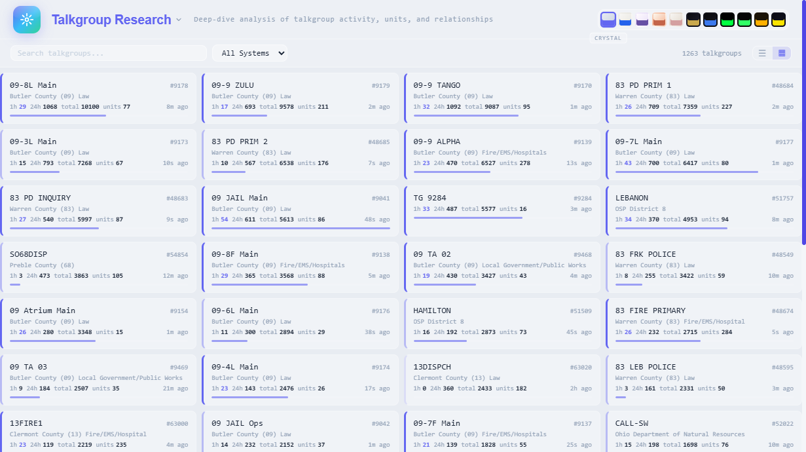
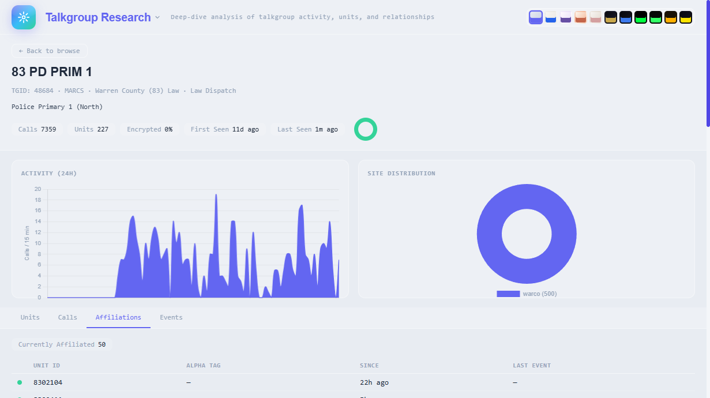
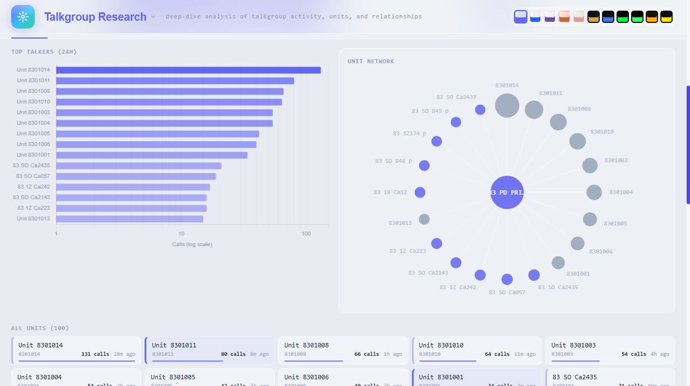
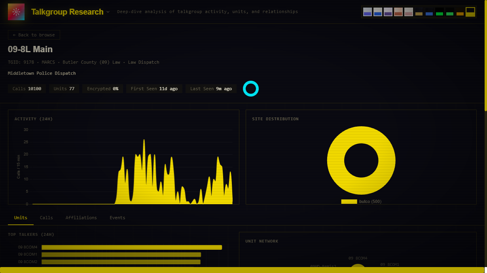
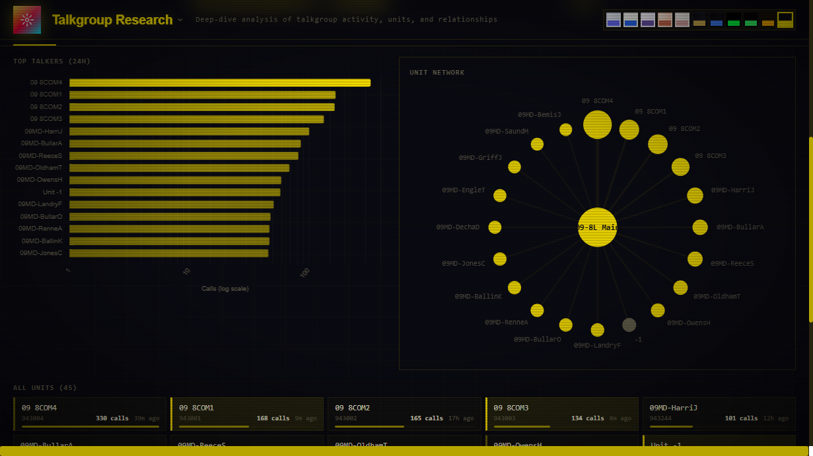

# tr-engine

Backend service that ingests data from [trunk-recorder](https://github.com/robotastic/trunk-recorder) instances via MQTT or filesystem watching and serves it via a REST API. Handles radio system monitoring data: calls, talkgroups, units, and recorder state.

Zero configuration for radio systems — tr-engine discovers systems, sites, talkgroups, and units automatically. Point it at a broker, a watch directory, or a trunk-recorder install, give it a database, and it figures out the rest.

> **Note:** This is a ground-up rewrite of the original tr-engine, now archived at [LumenPrima/tr-engine-v0](https://github.com/LumenPrima/tr-engine-v0). The database schema is not compatible — there is no migration path from v0. If you're coming from v0, see the **[migration guide](docs/migrating-from-v0.md)**. If you're starting fresh, you're in the right place.

> **Warning:** This project is almost entirely AI-written (Claude Code pair programming). It works, but it may also eat your computer or your pets. Specifically:
> - **Set `AUTH_TOKEN` before exposing to the internet.** tr-engine includes bearer token auth, per-IP rate limiting, CORS origin restrictions, and request body size limits — but all are opt-in or have permissive defaults. For production use, set `AUTH_TOKEN`, configure `CORS_ORIGINS`, and put it behind a reverse proxy (Caddy, nginx, etc.) with TLS.
> - **The ad-hoc SQL query endpoint (`/query`)** is disabled unless `AUTH_TOKEN` is set, and runs in a read-only transaction with a 30-second timeout.
> - **Installation instructions have not been thoroughly vetted** and may cause random fires. Test in a disposable environment first.

## Screenshots

> Live demo: [tr-engine.luxprimatech.com](https://tr-engine.luxprimatech.com)

### Talkgroup Research — Browse View
Browse all discovered talkgroups with search, system filtering, and sortable columns. Card grid and list views available.



### Talkgroup Research — Detail View
Click any talkgroup to see stats, 24-hour activity timeline, site distribution, and encryption indicator.



### Units Tab — Top Talkers & Network Graph
Horizontal bar chart of most active units plus an interactive SVG network graph showing unit-to-talkgroup relationships.



### Dark Theme (Night City)
All pages support 11 switchable themes. Here's the detail view with activity chart and calls tab.




## Tech Stack

- **Go** — multi-core utilization at high message rates
- **PostgreSQL 17+** — partitioned tables, JSONB, denormalized for read performance
- **MQTT + File Watch** — ingests from trunk-recorder via MQTT or filesystem monitoring (or both)
- **REST API** — 49 endpoints under `/api/v1`, defined in `openapi.yaml`
- **SSE** — real-time event streaming with server-side filtering
- **Web UI** — built-in dashboards demonstrating API and SSE capabilities

## Quick Start

Run this from your trunk-recorder directory (requires [Docker](https://docs.docker.com/get-docker/)):

```bash
curl -sL https://raw.githubusercontent.com/LumenPrima/tr-engine/master/install.sh | sh
```

That's it. Open http://localhost:8080 — call recordings will appear as trunk-recorder captures them.

To remove: `cd tr-engine && docker compose down -v && cd .. && rm -rf tr-engine`

## Other Installation Methods

- **[Docker Compose](docs/docker.md)** — full setup with PostgreSQL, MQTT broker, and tr-engine
- **[Docker with existing MQTT](docs/docker-external-mqtt.md)** — Docker Compose connecting to a broker you already run
- **[Build from source](docs/getting-started.md)** — compile from source, bring your own PostgreSQL
- **[Binary releases](docs/binary-releases.md)** — download a pre-built binary, just add PostgreSQL

## Updating

```bash
docker compose pull && docker compose up -d
```

This pulls the latest image and recreates the container. Your database and audio files are stored in named Docker volumes (`tr-engine-db`, `tr-engine-audio`) and persist across updates — only `docker compose down -v` (with the `-v` flag) removes them.

If a release includes database schema changes, run the updated `schema.sql` against your database:

```bash
curl -sO https://raw.githubusercontent.com/LumenPrima/tr-engine/master/schema.sql
docker compose exec -T postgres psql -U trengine trengine < schema.sql
```

The schema uses `IF NOT EXISTS` throughout, so re-running it is safe. Check the release notes for any additional migration steps.

## Configuration

Configuration is loaded in priority order: **CLI flags > environment variables > .env file > defaults**.

The `.env` file is auto-loaded from the current directory on startup. See `sample.env` for all available fields.

### CLI Flags

```
--listen        HTTP listen address (default :8080)
--log-level     debug, info, warn, error (default info)
--database-url  PostgreSQL connection URL
--mqtt-url      MQTT broker URL
--audio-dir     Audio file directory (default ./audio)
--watch-dir     Watch TR audio directory for new files
--tr-dir        Path to trunk-recorder directory for auto-discovery
--env-file      Path to .env file (default .env)
--version       Print version and exit
```

### Key Environment Variables

| Variable | Required | Default | Description |
|----------|----------|---------|-------------|
| `DATABASE_URL` | Yes | | PostgreSQL connection string |
| `MQTT_BROKER_URL` | * | | MQTT broker URL (e.g., `tcp://localhost:1883`) |
| `WATCH_DIR` | * | | Watch TR audio directory for new files |
| `TR_DIR` | * | | Path to trunk-recorder directory for auto-discovery |
| `MQTT_TOPICS` | No | `#` | MQTT topic filter (match your TR plugin prefix with `/#`) |
| `HTTP_ADDR` | No | `:8080` | HTTP listen address |
| `AUTH_TOKEN` | No | | Bearer token for API auth (disabled if empty) |
| `CORS_ORIGINS` | No | `*` | Comma-separated allowed CORS origins (empty = allow all) |
| `RATE_LIMIT_RPS` | No | `20` | Per-IP rate limit (requests/second) |
| `RATE_LIMIT_BURST` | No | `40` | Per-IP rate limit burst size |
| `AUDIO_DIR` | No | `./audio` | Audio file storage directory |
| `TR_AUDIO_DIR` | No | | Serve audio from trunk-recorder's filesystem (see below) |
| `CSV_WRITEBACK` | No | `false` | Write alpha_tag edits back to TR's CSV files on disk |
| `WATCH_INSTANCE_ID` | No | `file-watch` | Instance ID for file-watched calls |
| `WATCH_BACKFILL_DAYS` | No | `7` | Days of existing files to backfill on startup (0=all, -1=none) |
| `LOG_LEVEL` | No | `info` | Log level |

\* At least one of `MQTT_BROKER_URL`, `WATCH_DIR`, or `TR_DIR` must be set. All three can run simultaneously.

See `sample.env` for the full list including MQTT credentials, HTTP timeouts, transcription, and raw archival settings.

### Audio Modes

tr-engine supports two modes for call audio:

- **MQTT audio (default):** trunk-recorder sends base64-encoded audio in MQTT messages. tr-engine decodes and saves the files to `AUDIO_DIR`. Enable this by setting `mqtt_audio: true` in trunk-recorder's MQTT plugin config.

- **Filesystem audio (`TR_AUDIO_DIR`):** trunk-recorder saves audio files to its local filesystem. tr-engine serves them directly using the `call_filename` path stored at call_end. Set `TR_AUDIO_DIR` to the directory where trunk-recorder writes audio (its `audioBaseDir`). This avoids the overhead of base64 encoding/decoding over MQTT and eliminates duplicate files. When using this mode, keep `mqtt_audio: true` but set `mqtt_audio_type: none` in the TR plugin config — this sends the call metadata message (frequencies, transmissions, unit list) without the base64 audio payload, saving encoding CPU and MQTT bandwidth.

Both modes can coexist during a transition. Existing calls with MQTT-ingested audio continue to serve from `AUDIO_DIR`; new calls resolve from `TR_AUDIO_DIR`.

## How It Works

### Ingest Modes

tr-engine supports three ingest modes that can run independently or simultaneously:

- **MQTT** — subscribes to trunk-recorder's MQTT status plugin for real-time call events, unit activity, recorder state, and decode rates. The richest data source.
- **File Watch** (`WATCH_DIR`) — monitors trunk-recorder's audio output directory for new `.json` metadata files via fsnotify. Only produces `call_end` events (no `call_start`, unit events, or recorder state). Backfills existing files on startup (configurable via `WATCH_BACKFILL_DAYS`).
- **TR Auto-Discovery** (`TR_DIR`) — the simplest setup. Point at the directory containing trunk-recorder's `config.json`. Auto-discovers `captureDir` (sets `WATCH_DIR` + `TR_AUDIO_DIR`), system names, imports talkgroup CSVs and unit tag CSVs (`unitTagsFile`) into the database. If a `docker-compose.yaml` is found, container paths are translated to host paths via volume mappings. With `CSV_WRITEBACK=true`, alpha_tag edits are written back to the CSV files on disk.

### Auto-Discovery

tr-engine builds its model of the radio world automatically. When trunk-recorder publishes messages (MQTT) or writes files (watch mode), tr-engine:

1. **Identifies systems** by matching P25 `(sysid, wacn)` pairs or conventional `(instance_id, sys_name)`
2. **Discovers sites** within each system — multiple TR instances monitoring the same P25 network auto-merge into one system with separate sites
3. **Tracks talkgroups and units** as they appear in call and unit events

```
System "MARCS" (P25 sysid=348, wacn=BEE00)
  |- Site "butco"  (nac=340, instance=tr-1)
  |- Site "warco"  (nac=34D, instance=tr-2)
  |- Talkgroups (shared across all sites)
  +- Units (shared across all sites)
```

### Data Flow

```
trunk-recorder  ──MQTT──>  broker  ──MQTT──>  tr-engine  ──REST/SSE──>  clients
      |                                            |
      +──audio files──>  fsnotify watcher ─────────+
                                                   v
                                               PostgreSQL
```

MQTT messages are routed to specialized handlers (calls, units, recorders, rates, trunking messages, etc.) that write to PostgreSQL and publish events to the SSE bus. File-watched calls go through the same pipeline as `call_end` events.

## Real-Time Event Streaming

`GET /api/v1/events/stream` pushes filtered events over SSE.

- **Filter params** (all optional, AND-ed): `systems`, `sites`, `tgids`, `units`, `types`, `emergency_only`
- **8 event types**: `call_start`, `call_update`, `call_end`, `unit_event`, `recorder_update`, `rate_update`, `trunking_message`, `console`
- **Compound type syntax**: `types=unit_event:call` filters by subtype
- **Reconnect**: `Last-Event-ID` header for gapless recovery (60s server-side buffer)

## API Endpoints

All under `/api/v1`. See `openapi.yaml` for the full specification.

| Endpoint | Description |
|----------|-------------|
| `GET /health` | Service health + TR instance status |
| `GET /systems` | List radio systems |
| `GET /talkgroups` | List talkgroups (filterable) |
| `GET /units` | List radio units |
| `GET /calls` | List call recordings (paginated, filterable) |
| `GET /calls/active` | Currently in-progress calls |
| `GET /calls/{id}/audio` | Stream call audio |
| `GET /unit-events` | Unit event queries (DB-backed) |
| `GET /unit-affiliations` | Live talkgroup affiliation state (in-memory) |
| `GET /call-groups` | Deduplicated call groups across sites |
| `GET /recorders` | Recorder hardware state |
| `GET /events/stream` | Real-time SSE event stream |
| `GET /stats` | System statistics |
| `GET /talkgroup-directory` | Search talkgroup reference directory |
| `POST /talkgroup-directory/import` | Upload talkgroup CSV |
| `GET /calls/{id}/transcription` | Primary transcription for a call |
| `GET /transcriptions/search` | Full-text search across transcriptions |
| `PUT /calls/{id}/transcription` | Submit human correction |
| `POST /calls/{id}/transcribe` | Enqueue call for transcription |
| `POST /admin/systems/merge` | Merge duplicate systems |
| `POST /query` | Ad-hoc read-only SQL queries |

## Web UI

tr-engine ships with several built-in dashboards at `http://localhost:8080`. The index page auto-discovers all pages and links to them.

| Page | Description |
|------|-------------|
| **Event Horizon** | Logarithmic timeline — events drift from now into the past |
| **Live Events** | Real-time SSE event stream with type filtering |
| **Unit Tracker** | Live unit status grid with state colors and group filters |
| **IRC Radio Live** | IRC-style monitor — talkgroups as channels, units as nicks, audio playback |
| **Scanner** | Mobile-friendly radio scanner with auto-play and channel filtering |
| **Talkgroup Directory** | Browse and import talkgroup reference data from CSV |
| **Talkgroup Research** | Deep-dive analysis — browse table, detail view with charts, unit network graph, call history with audio, live affiliations, events |
| **Call History** | Searchable call log with inline audio playback, expandable detail rows, transmission timeline |
| **Signal Flow** | Stream graph of talkgroup activity over time (D3.js) |
| **API Docs** | Interactive Swagger UI for the REST API |

Pages are plain HTML with no build step. Add new pages by dropping an `.html` file in `web/` with a `<meta name="card-title">` tag — see [CLAUDE.md](CLAUDE.md#web-frontend-page-registration) for the spec.

## Storage Estimates

Observed with 2 moderately busy counties and 1 trunk-recorder instance:

| Category | Estimated Annual Usage |
|----------|----------------------|
| Database (permanent tables) | ~22 GB/year |
| Database (state + logs overhead) | ~3 GB steady-state |
| Audio files (M4A) | ~140 GB/year |

High-volume tables (calls, unit_events, trunking_messages) are automatically partitioned by month. Partition maintenance runs on startup and every 24 hours.

## Project Structure

```
cmd/tr-engine/main.go           Entry point with CLI flag parsing
internal/
  config/config.go              .env + env var + CLI config loading
  database/                     PostgreSQL connection pool + query files
  mqttclient/client.go          MQTT client with auto-reconnect
  ingest/
    pipeline.go                 MQTT message dispatch + batchers
    router.go                   Topic-to-handler routing
    identity.go                 System/site identity resolution + caching
    eventbus.go                 SSE pub/sub with ring buffer replay
    watcher.go                  fsnotify-based file watcher for watch mode
    handler_*.go                Per-topic message handlers
  trconfig/
    trconfig.go                 TR config.json, docker-compose, and CSV parsers
    discover.go                 TR auto-discovery orchestrator
  api/
    server.go                   Chi router + HTTP server
    middleware.go               RequestID, logging, recovery, auth, rate limiting, body limits
    events.go                   SSE event stream endpoint
    *.go                        Handler files for each resource
web/                            Built-in dashboards (auto-discovered by index)
openapi.yaml                    API specification (source of truth)
schema.sql                      PostgreSQL DDL
sample.env                      Configuration template
```

## Changelog

### v0.8.5

- **Talkgroup Research page** — two-view investigation tool with browse table/card grid, full-page detail view with 24h activity chart, site distribution doughnut, encryption badge, units tab with top talkers bar chart and interactive SVG unit network graph, calls tab with audio playback, affiliations tab with auto-refresh, and events tab with type filtering. 11 switchable themes.
- **API: Cloudflare-safe composite IDs** — all endpoints accepting `system_id:entity_id` now also accept `system_id-entity_id` (dash separator), avoiding Cloudflare WAF blocks on colons in URL paths
- **API: call_count on talkgroup units** — `GET /talkgroups/{id}/units` now returns `call_count` per unit, sorted by most active first
- **API: unit_id alias** — unit-events responses now include `unit_id` alongside `unit_rid` for consistency with other endpoints

### v0.8.3

- **Call History page** — searchable, filterable call log with inline audio playback, expandable detail rows, transmission timeline, and URL-synced filters
- **Fix audio playback auth** — `<audio>` elements now include auth token via `?token=` query param (fixes playback on IRC Radio, Call History, and Scanner)

### v0.8.2

- Page visibility management in nav dropdown
- Theme engine improvements

### v0.8.1

- **Fix duplicate system creation on fresh start** — calls arriving before system registration no longer create phantom systems with `sysid=0`. A warmup gate buffers non-identity messages until the first system registration establishes real P25 identity, then replays the buffer. Skipped on restart when identity is already cached.
- **Fix duplicate channel names in IRC Radio Live** — talkgroups sharing an `alpha_tag` across systems now disambiguate with the system name (e.g., `#ARA-Sec-arasaka` / `#ARA-Sec-corpsec`). Same-system collisions use tgid. Both sides of a collision are renamed, not just the second arrival.

### v0.8.0

- Proxy-aware per-IP rate limiting (`RATE_LIMIT_RPS`, `RATE_LIMIT_BURST`)
- CORS origin restrictions (`CORS_ORIGINS`)
- 10 MB request body limit, response timeout for non-streaming handlers
- Unit CSV import from trunk-recorder's `unitTagsFile`
- `CSV_WRITEBACK` — write alpha_tag edits back to TR's CSV files on disk
- Tag source tracking (`alpha_tag_source`) — manual edits preserved across MQTT/CSV re-imports
- Affiliation map eviction for stale entries

## License

MIT
